```{r setup, include=FALSE}
knitr::opts_chunk$set(echo = TRUE)
```

***Name: JJ McCauley***

# Introduction

If we want to estimate a parameter of population - say, the mean of population - we can use a mean of a sample for our estimate. Imagine we have several different samples of the same size n. Chances are the means of those samples are different, at least some of them. On the other hand, since samples are random, sample means are random as well. Hence, we can look at sample means as values of a random variable and study the corresponding distribution and its properties.

The **sampling distribution** of a statistic (such as a sample mean or sample proportion) is the distribution of all values of the statistic when $\underline{\text{all possible samples}}$ of the same size n are taken from the same population. Sampling distribution of sample mean $\overline{X}$ has the following properties:

1.  If the sampled population has a finite mean $\mu$, then the mean of the sampling distribution of $\overline{X}$, $\mu_{\overline{X}}$, equals the mean of the sampled population, $\mu$. That is $\mu_{\overline{X}}=E[X]=\mu$.

2.  If the sampled population has a finite standard deviation $\sigma$, then the standard deviation of the sampling distribution of $\overline{X}$ equals $$
    \frac{\text{standard deviation of sampled population}}{\text{square root of sample size}},
    $$ that is $\sigma_{\overline{X}}=\frac{\sigma}{\sqrt{n}}$.

In addition to the properties above, describing mean and standard deviation of the sampling distribution of sample mean, in certain cases we know the shape of sampling distribution. We will see later how useful those fact can be.

The theorem summarizing shape and parameters of sampling distribution is called the **Central Limit Theorem**. There are many variations of the Central Limit Theorem. in this course we are going to use the following two:

-   The sampling distribution of $\overline{X}$ will be normal with mean $\mu_{\overline{X}}=E[X]=\mu$ and standard deviation $\sigma_{\overline{X}}=\frac{\sigma}{\sqrt{n}}$, provided that a random sample of $n$ observations is selected from a population with a normal distribution with population mean $\mu$ and population standard deviation $\sigma$.

-   The sampling distribution of $\overline{X}$ will be approximately normal with mean $\mu_{\overline{X}}=E[X]=\mu$ and standard deviation $\sigma_{\overline{X}}=\frac{\sigma}{\sqrt{n}}$, provided that a random sample of **sufficiently large** $n$ observations is selected from **any** population with a finite population mean $\mu$ and a finite population standard deviation $\sigma$.

Notice that statements of both versions of the Central Limit Theorem are the same, but assumptions are different. In one, normality of the "parent" or sampled distribution is required. The other version is valid for any (with finite population mean and standard deviation) distribution of the "parent" distribution as long as sample is large enough. For most sampled population, sample sizes of $n\geq 30$ will suffice for the normal approximation of sampling distribution to be reasonable.

Notice that if the "parent" distribution is different from normal and sample is small (less than 30), or non-normal with infinite mean and standard deviation (even when the sample size is large), then we cannot claim that sampling distribution is normal and parameters, mean and standard deviation, are as stated.

In this lab, we are going to examine the properties of the sampling distribution of sample means and the central limit theorem. We will use a shiny app "CLTapp.R". In the app, we will consider six different types of "parent" distributions. For each distributions, we will explore how does the sample size affects our observations of the discussed properties.

But before we dig into the app, let's learn some preliminary knowledge about checking the normality of a data set, and how to insert images into your R Markdown report.

# Part I: Checking Normality Using Histogram and QQ-Plot

Since the Central Limit Theorem states that when certain assumptions are satisfied, the sampling distribution of sample means will be (or approach to) a particular normal distribution. Thus it is important to know how to check whether a data set (in this lab, the collection of sample means) is from a normal distribution. While more details will be discussed in Lab 7, one simple graphical method for checking the normality is using **histogram** and **QQ-plot**.

In statistics, a histogram is an approximate representation of the distribution of numerical data. A QQ-plot (quantile-quantile plot) is a probability plot, a graphical method for comparing two probability distribution (x-the theoretical normal quantiles, y-the data set quantiles). If a data set is from a normal distribution, then we can expect that its histogram will be **approximately bell-shape**, **AND** the points in the **QQ-plot** will **approximately lie on the identity straight line** $y=x$.

Let's insert the image "QQ_normal.png" to this R Markdown file as an example. Before you insert the image, make sure it is in the SAME folder with this R Markdown file.

To add images to an R markdown file (when the image is in the same folder), we can use the following syntax

```         

```

So, in our case, directly type the following outside any chunk. Then click "Visual" on the left-top corner, then click it again.

```         
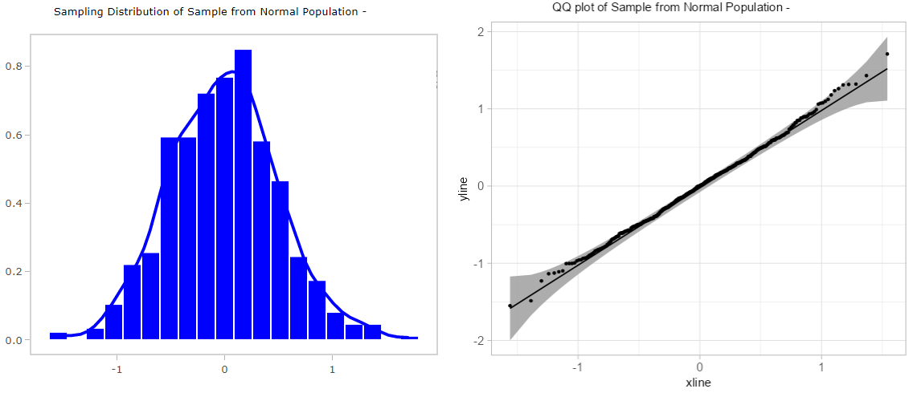
```


You can see that histogram (on the left-hand side) is approximately bell-shape and the points in the QQ-plot (on the right-hand side) approximately lie on the straight line. So the sample is drawn from an approximately normal distribution.

## Assignment 1

Now, insert the images "QQ_rightskewed.png", "QQ_leftskewed.png", "QQ_bimodal.png", and "QQ_cauchy.png". Then describe your observations on the histograms and QQ-plots, and determine whether the corresponding data set is from a normal distribution.

1.  Insert "QQ_rightskewed.png" below.


Describe your observation below.

```         
Based on these graphs, this data set is not from a normal distribution. On the histogram, the data is skewed right with the tail of the distribution extending to the right and the peak falling on the left-hand side of the graph. Based on the QQ plot, we can see that numerous points deviate from the line, meaining that it is not normally distributed and instead right skewed.
```

2.  Insert "QQ_leftskewed.png" below.


Describe your observation below.

```         
Based on these graphs, this data set is not from a normal distribution. On the histogram, the data is skewed left with the tail of the distribution extending to the left and the peak falling on the left-hand side of the graph. Based on the QQ plot, we can see that numerous points deviate from the line, meaining that it is not normally distributed and instead left skewed.
```

3.  Insert "QQ_bimodal.png" below.


Describe your observation below.

```         
Based on the graphs, this data does not follow a normal distribution. This is clear in the histogram since there are multiple peaks, additionally with the highest peak being on the left side. Additionally, the QQ plot shows significant deviations from the center line.
```

4.  Insert "QQ_cauchy.png" below.

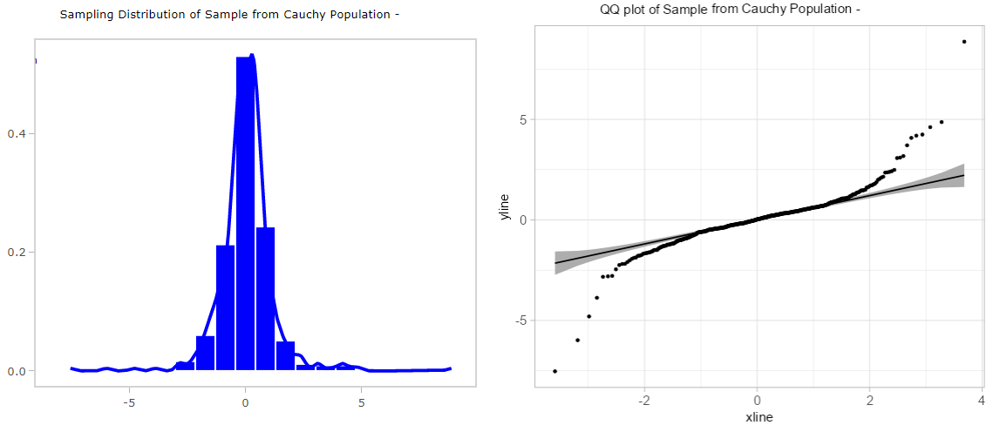

Describe your observation below.

```         
Although the histogram shows that of a weak normal distribution, it can be clearly seen in the QQ plot that the data deviates significantly from the center line. Therefore, it is not a normal distribution.
```

**End of Assignment 1**

# Part II: Sampling Distributions of Sample Means: When Assumptions are Satisfied

Recall the assumptions needed to observe the properties of sampling distribution of sample means"

1.  The "parent" population has a finite mean $\mu$

2.  The "parent" population has a finite standard deviation $\sigma$

3.  a\. The "parent" population follows a normal distribution (then sample size $n$ doesn't matter), OR

    b\. The "parent" population can be any distribution, as long as assumptions 1 and 2 are satisfied, and the sample size $n$ is sufficiently large ($n\geq 30$ for most of the cases).

Let's use the **Shiny Web App** "CLTapp.R" to explore the properties of sampling distribution of sample means.

Double click that file, and click the "Run App" button on the top of the editor. You should be able to see the following app window.

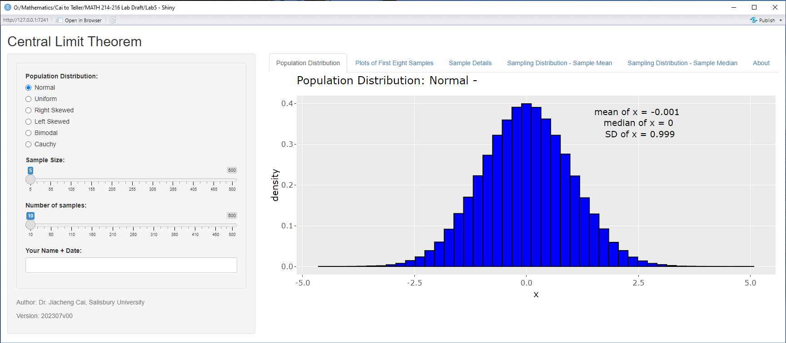

**TYPE YOUR NAME AND DATE IN THE TEXTBOX ON THE LEFT-BOTTOM CORNER**

Let's take a look at the app. On the left-hand side, you can select the population distribution ("parent" distribution) that you want to sample from. You can also change the sample size (how many values in ONE sample) and the number of samples (how many times to repeat the sampling).

On the right-hand side, there are several tabs on the top. The first one "Population Distribution" present the histogram of the "parent" distribution (approximated by a sample with size of 300000). Move your mouse to the graph, you can see several icons pop up on the right-top corner. Click the first one "Download plot as a png", save the plot to the SAME folder with this R Markdown, then you can insert the image to this Markdown report, as you did in assignment 1.

The second tab "Plots of First Eight Samples" present the dotplots of the first 8 samples from the distribution. You can change the sample size and the population distribution and see how the dotplots changes correspondingly.

The third tab "Sample Details" presents the details values and statistics from the computer simulations. Each column represents ONE sample (and the 8 dotplots in the second tab are from the first 8 column here). You can see the detailed values in each sample (value 1, 2, etc.), Based on the values in each column, you can compute the sample mean/median/standard deviation (presented on the first three rows). If you have 100 samples, then you can obtain 100 sample means/medians. Then based on these 100 sample means (or medians), you can plot their histogram and QQ-plot (presented on the forth and the fifth tabs).

Based on the app, we can now explore the properties of sampling distribution of sample means by going over the following assignments.

## Assignment 2

1.  Set the Population Distribution as "Normal", the Sample Size as 5, and the Number of samples as 500.

2.  Go to the "Population Distribution" tab, download the distribution plot and name it as "pop_normal.png", then insert the image below.

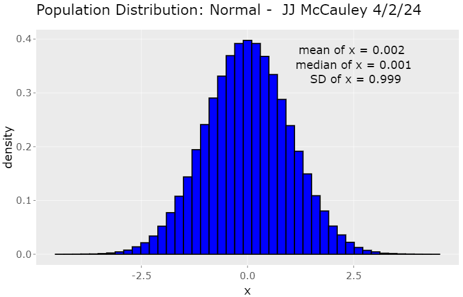

3.  Based on the population distribution plot, answer the questions: what is the mean and standard deviation of this "parent" distribution, does it satisfy the assumptions? (specify which conditions are satisfied, especially 3a or 3b)

    ```         
    This distribution has a finite mean of .002 and a finite standard deviation of .999, which satisfied conditions 1 and 2. Additionally, this curve follows a normal distribution, therefore it satisfies condition 3a.
    ```

4.  Go to the "Sampling Distribution - Sample Mean" tab, download the histogram and QQ-plot (for QQ-plot, you may need to right click you mouse on that plot, and click "Save image as..."). Name the plots as "sample_hist_normal_n5.png" and "sample_qq_normal_n5.png" (n5 means sample size n=5). Then insert the plots below.

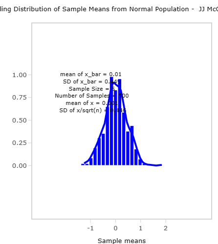 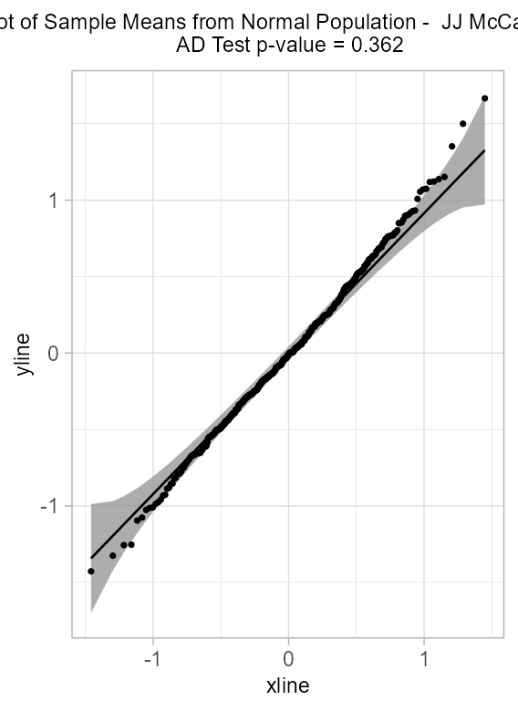

5.  Based on the histogram and QQ_plot, answer the questions: what is the mean and standard deviation of $\overline{X}$? Do they (approximately) equal to the population mean and $\sigma/\sqrt(n)$, respectively? Based on the histogram and QQ_plot, determine whether the sampling distribution of sample means is approximately normal distributed.

    (In the case when the calculation results on the histogram are covered by the image, move you mouse to the plot, use the "pan" pop-up icon and/or "zoom in" pop_up icon to get a clearer view)

    ```         
    The mean of x bar is .01, which is close to the mean of x, .001. The standard deviation of x/sqrt(n) is .447, which is very close to the standard deviation of x, .449. Additionally, the histogram appears approximately normal and the QQ plot has only slight deviations, so this would be roughly normal.
    ```

6.  Keep the Population Distribution as "Normal"and the Number of samples as 500. But change the Sample Size to 30 and 100. Then answer questions 4 and 5 respectively. (when you download the plots, make sure to adjust the name to n30 and n100, respectively)

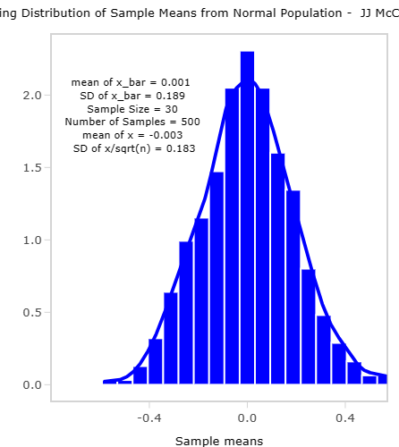 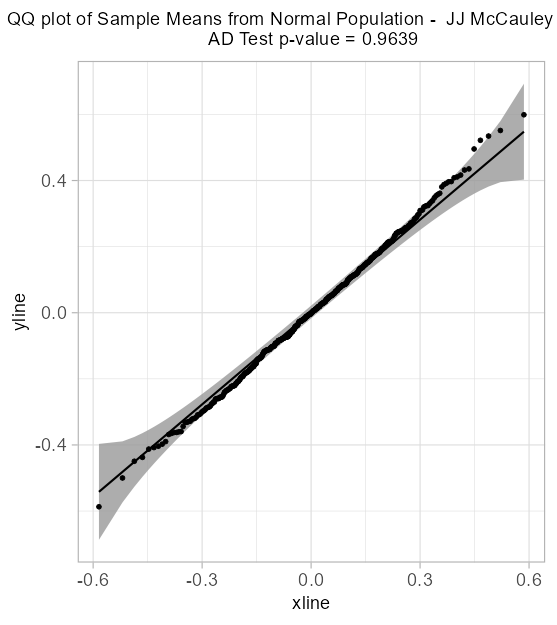

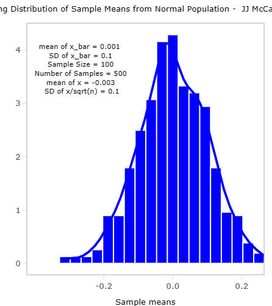 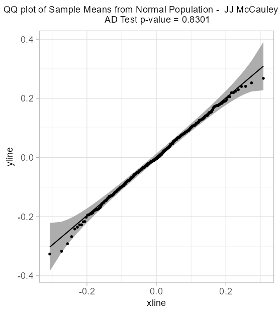

```         
When the sample size is 30, the mean of x bar is .001 while the standard deviation of x/sqrt(n) is .183 and the mean of x is -.003. While the mean of x bar and x is almost equal, there is a difference in the SD of x/sqrt(n). Additionally, when looking at the QQ plot, the dots only deviate slighly from the center line, signifying that this is about normal. This is also reflected in the histogram.

When the sample size is 100, x bar is .001, the mean of x is -.003, and the SD of x/sqrt(n) is .1. These numbers show a greater relevance than the prior example, with the difference of the mean of x bar and x only being .004 and with the data closing the gap between the mean of x bar and the SD of x/sqrt(n). When looking at the QQ plot and histogram, it can be examined that this data is very roughly normal, potentially slighltly right skewed.
```

7.  Comparing results on questions 4, 5, and 6. How does the sample size affect the results?

    ```         
    Increasing the sample size appears to close the gap between the mean of x bar and the mean of x & the standard deviation of x/sqrt(n). Additionally, as the sample size increases, the data is more tightly-fitting to the center line of the QQ plot.
    ```

**End of Assignment 2**

The above is the case when the "parent" distribution is already normal. Next, let's consider the cases when the "parent" distribution is non-normal.

## Assignment 3

Set the Population Distribution to "Uniform", "Right Skewed", "Left Skewed", and "Bimodal". Then Answer all questions in Assignment 2 for EACH Population Distribution, respectively.

Type \### to specified the population, for example

```         
### Uniform Pop Distribution

3) This distribution has a finite mean of .5 and a finite standard deviation of .289, which meets conditions 1 and 2. This distribution does not meet condition 3a, which states that this is a normal distribution. However, if the sample size is "sufficiently large" enough for this dataset, then condition 3b will be met.

5) When the sample size is 5, the mean of x bar is .496, which is very close to the mean of x, .5 . The standard deviation of x/sqrt(n) is .129, which is close to the standard deviation of x bar, .134 . Based on the histogram, this data appears to very roughly normal, with a peak around the mean and with few noticable deviations around the qq plot.

6) When the sample size is 30, the mean of x bar is .5, which is exactly equal to the mean of x. The standard deviation of x/sqrt(n) is .053, which is very close to the standard deviation of x bar, .055. Based on the plots, this appears to be a rough normal distribution, being closer to a normal distribution than when the sample size is 5.
When the sample size is 100, the mean of x bar is .501, which is essentially equivalent to mean of x (.5). The standard deviation of x/sqrt(n) is .029, which is exactly the standard deviation of x bar (.029). This is again roughly normal, with small deviations in the QQ plot but an overall normal-looking histogram. 

7) Increasing the sample size seems to minimize the gap between the mean of x bar and the mean of x, as well as the standard deviation of x/sqrt(n) and the standard deviation of x. Additionally, the graphs could become more of a normal distribution as the sample size increases.
```

Population Distribution 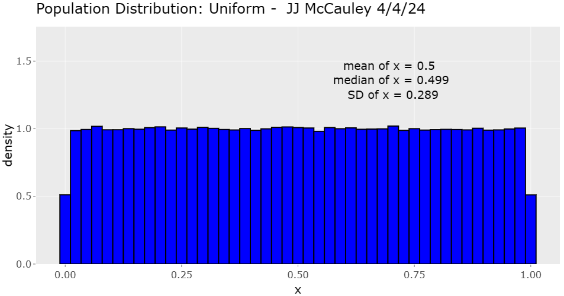

Sampling Distribution

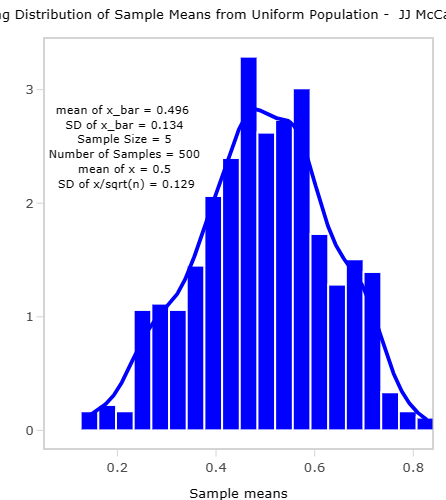  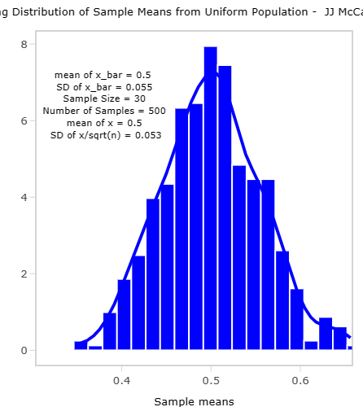 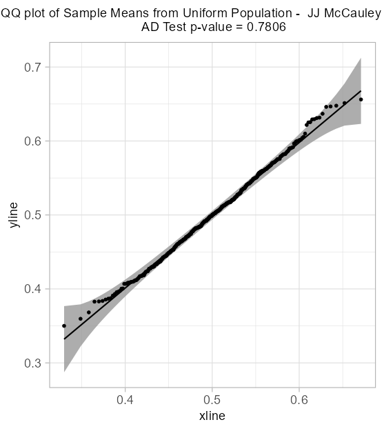 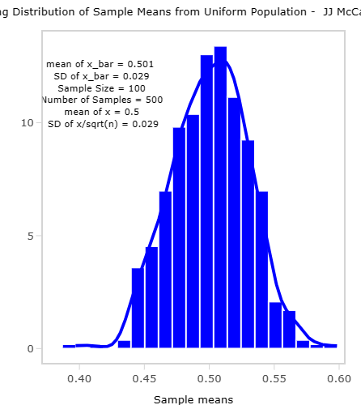 

```         
### Right Skewed Pop Distribution

3) The mean is 1.135 and the standard distribution is .605 . Since both are finite, it satisfies conditions 1 and 2. However, this is not a normal distribution, so a sample size of sufficiently large size (genrally 30 or greater) is required to meet this condition.

5) The mean of x bar is 1.15 while the mean of x is 1.134, making them fairly distant. The standard deviation of x is .259, which is somewhat close to the standard deviation of x/sqrt(n), .27 . This graph still appears to be right skewed, with the QQ plot agreeing with large deviations from the line.

6) When the sample size is 30, the mean of x bar is 1.131, which is very close to the mean of x, 1.134. The standard deviation of x bar is .111, which is also very close to the standard deviation of x/sqrt(n), .11 . This graph appears to be very roughly normal, with slight deviations on the qq plot but a bell-like shape curve on the histogram. 
When the sample size is 100, the mean of x bar is 1.135, which is very close to the mean of x, 1.134. The standard deviation of x bar is .06, which is exactly equal to the standard deviation of x/sqrt(n). This graph appears to not quite be a normal distribution, with normal deviations falling outside of the tolerable range in the QQ plot.

7) As the sample size increases, the gap between the mean of x bar and the mean of x closes. The same can be said about the standard deviation of x bar and the standard deviation of x/sqrt(n). Additionally, the curve appeared to be more of a normal distribution as n approached 30, however became less of one when n was 100.
```

Population Distribution

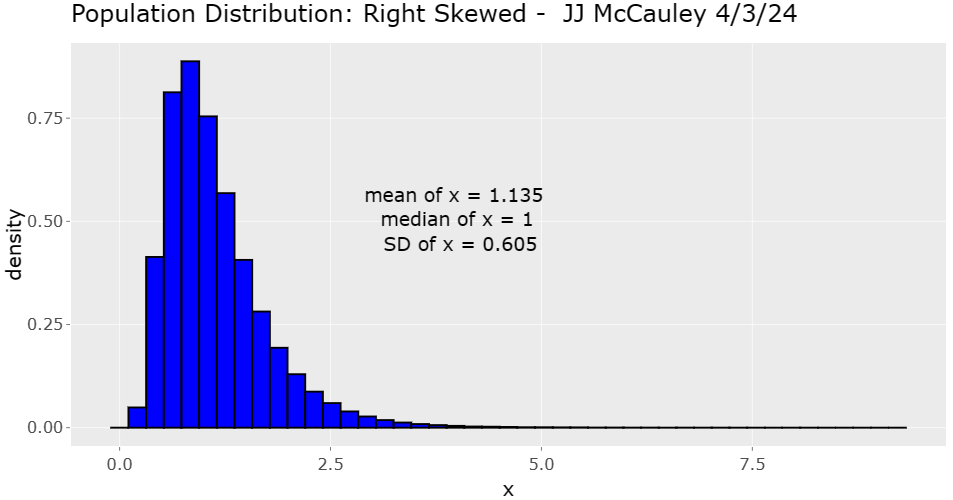

Sampling Distribution

 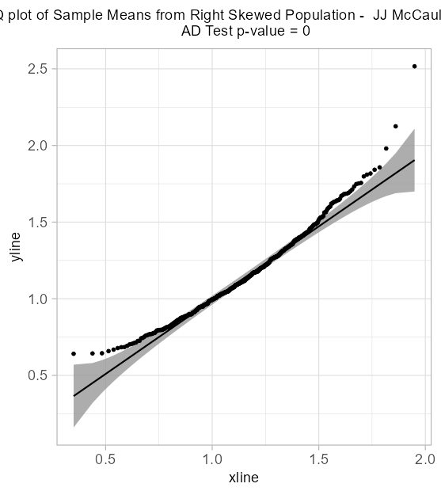 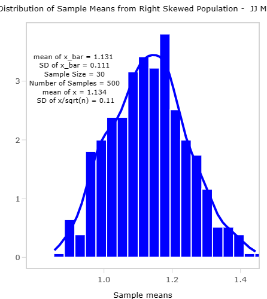  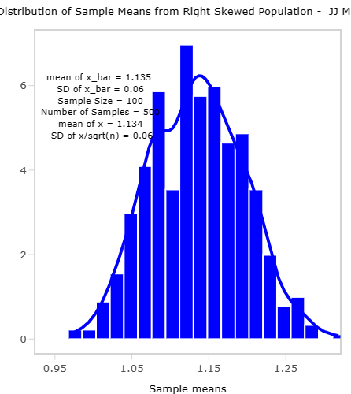 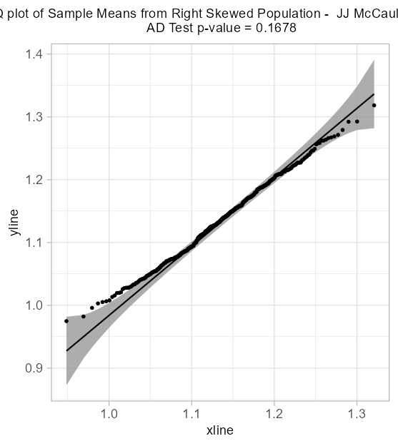

```         
### Left Skewed Pop Distribution

3) The mean is .769 and the standard distribution is .154 . Since both are finite, it satisfies conditions 1 and 2. However, this is not a normal distribution, so a sample size of sufficiently large size (genrally 30 or greater) is required to meet this condition.

5) The mean of x bar is .772, which is close to the mean of x, .769 . The standard deviation of bar, .067, is also fairly close to the standard deviation of x/sqrt(n), .069 . The plots suggest that this is still left-skewed.

6) When the sample size is 30, the mean of x bar is .768, which is very close to the mean of x, .769 . The standard deviation of x bar is .028, which is exactly the standard deviation of x/sqrt(n), .28 . The histogram appears to be in a roughly bell-like shape, with the qq plot agreeing with small but tolerable deviations.
When the sample size is 100, the mean of x bar is .771, while the mean of x is close, being .769 . The standard deviation of x bar, .016, is very close to the standard deviation of x/sqrt(n), .015 . These plots appear to be slighly left skewed, with the qq plot having significant deviations torwards the left point of the center line.

7) The sample size influences the gap between the mean of x and x bar, and the standard deviation between x bar and x/sqrt(n). As the sample size increases, these seem to get closer together. The same applies to it's state as a normal distribution, however it appears to have peak similarities when the sample size is 30.
```

Population Distribution

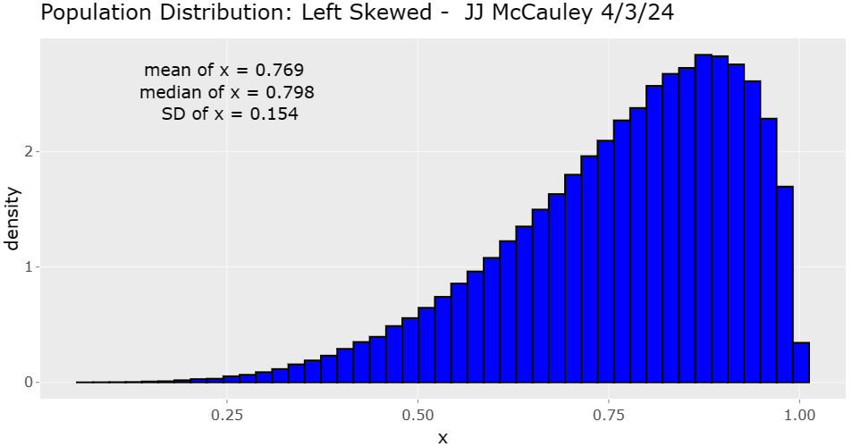

Sampling Distribution

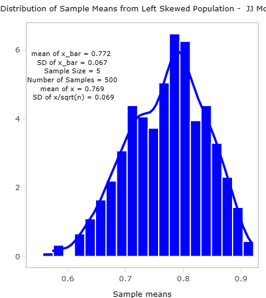 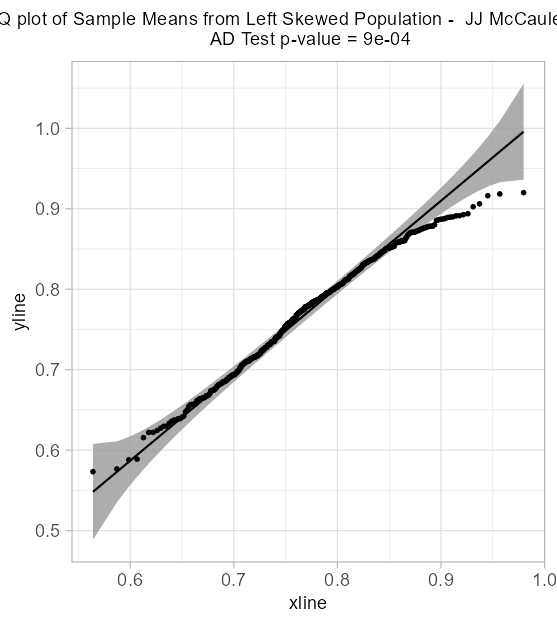 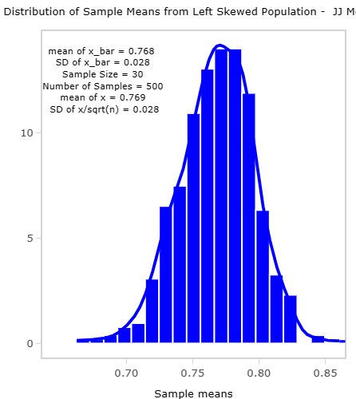  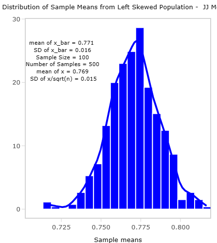 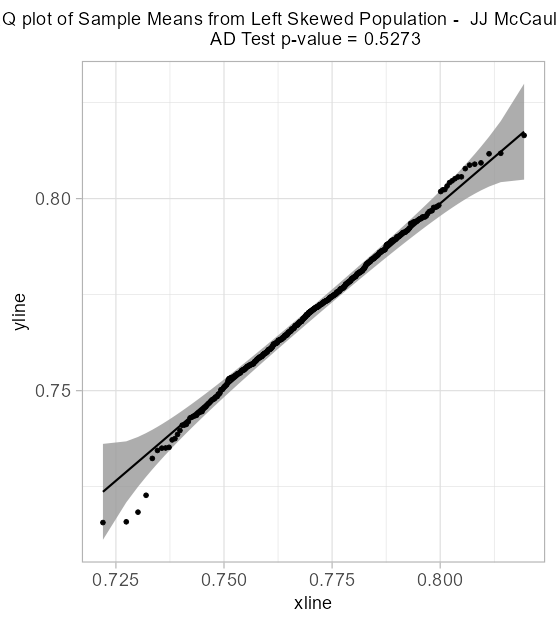

```         
### Bimodel Pop Distribution

3) The mean is .501 and the standard distribution is 2.959 . Since both are finite, it satisfies conditions 1 and 2. However, this is not a normal distribution, so a sample size of sufficiently large size (genrally 30 or greater) is required to meet this condition.

5) The mean of x bar is .62 and the mean of x is .498, so these two are not very similar. The standard deviation of x bar is 1.321, which is close to the standard deviation of x/sqrt(n) of 1.323 . This graph does not quite represent a normal distribution, with large deviations occuring in the QQ plot and the histogram having multiple peaks.

6) When the sample size is 30, the mean of x bar is .47 and the mean of x is .498, which is somewhat close. On the other hand, the standard deviation of x bar, .537, and the standard deviation of x/sqrt(n), .54, is fairly close. These plots does not support a perfect normal distribution, potentially showcasing an extremely rough one. This histogram has multiple peaks and the QQ plot has fairl significant deviations, although only the top/bottom few are very significant.
When the sample size is 100, the mean of x bar is .472 while the mean of x is .498, which is not very similar. The standard deviation of x bar is .301, while the standard deviation of x/sqrt(n) is .296, which is somewhat close. This graph does look fairly similar to a normal distribution, with the histogram following a bell-shaped curve and the QQ plot only showing slight deviations.

7) As the sample size increases, the gap between the means of x bar and x close, the gap between the standard deviations of x bar and x/sqrt(n) close, and the distributions become more normal.
```

Population Distribution

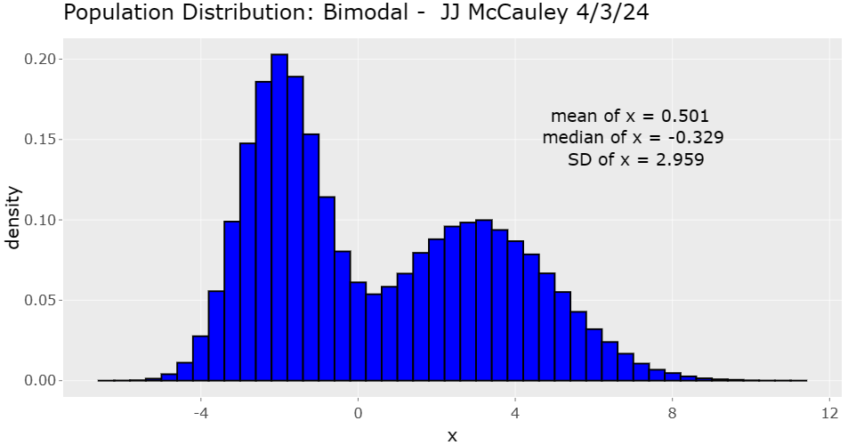

Sampling Distribution

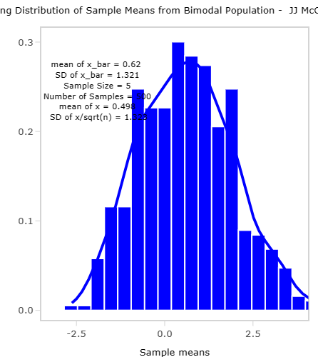 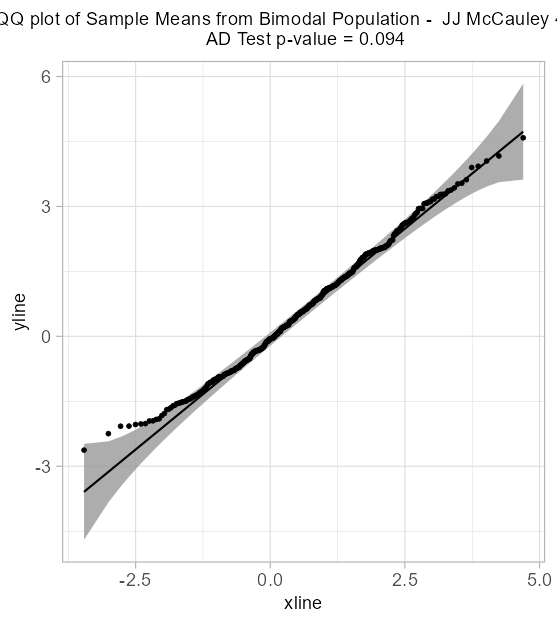 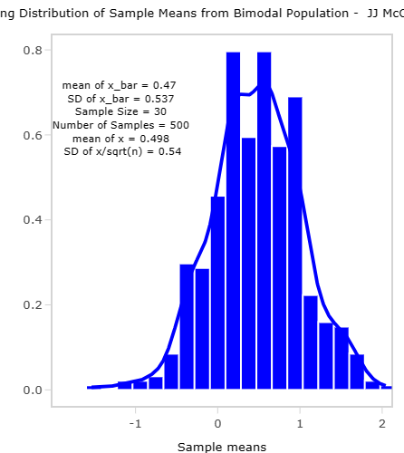 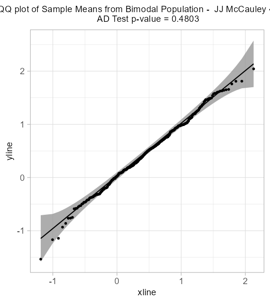 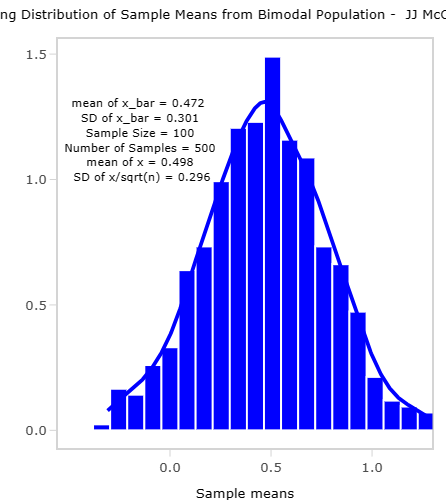 

**End of Assignment 3**

# Part III: Sampling Distributions of Sample Means: When Assumptions are NOT Satisfied

In part II, the "parent" distributions we selected in fact satisfied the assumptions needed for the Central Limit Theorem. But what if one or some of the assumptions are not satisfied? Will the Central Limit Theorem still hold? Let's consider a particular distribution: **Cauchy Distribution**.

One interesting facts about Cauchy distribution is that, it does NOT have defined mean or standard deviation, thus assumptions 1 and 2 are not satisfied. Let's explore the properties of the sampling distribution of sample means by completing the following assignment.

## Assignment 4

Set the Population Distribution to "Cauchy". Then Answer all questions in Assignment 2

```         
### Cauchy Pop Distribution

3) Both the mean and standard deviations are undefined, violating conditions 1 and 2. This is also not a normal distribution, violating condition 3a. However, if the sample size is sufficiently large (approximately above 30), then condition 3b could hold true.

5) When the sample size is 5, the mean of x bar is -1.194, while the mean of x is .042. These two are very different. Similarly, the standard deviation of x bar is 15.159, while the standard deviation of x/sqrt(n) is 77.963, which are completely different. This graph also does not follow a normal distribution at all, with the histogram showing one extreme peak and a large skewedness. Additionally, the qq plot shows extremely significant deviations.

6) When the sample size size 30, the mean of x bar is -.691, while the mean of x is .042. Similarly to the previous sample size, these are very different. Similarly, the standard deviation of x bar is 14.822, which is very different than the standard deviation of x/sqrt(n), 31.828 . This graph is not a normal distribition at all for the same reasons as the previous example (question #5).
When the sample size is 100, the mean of x bar is .738 while the mean of x is .042, which is not close. The standard deviation of x bar is 19.082, which is not very close to the standard deviation of x/sqrt(n), 17.433 . For similar reasons of the last two samples, these plots to not support a normal distribution.

7) As the sample size increases, the gap between the means of x bar and x close, the gap between the standard deviations of x bar and x/sqrt(n) close, and the distributions become more normal, although it may require a very large sample size to acheive an actual normal distribuition (if possible at all).
```

Population Distribution


Sampling Distribution

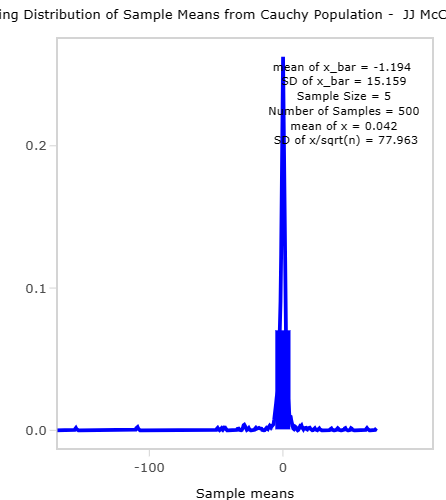 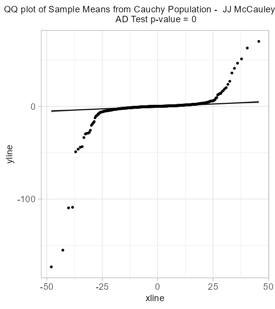 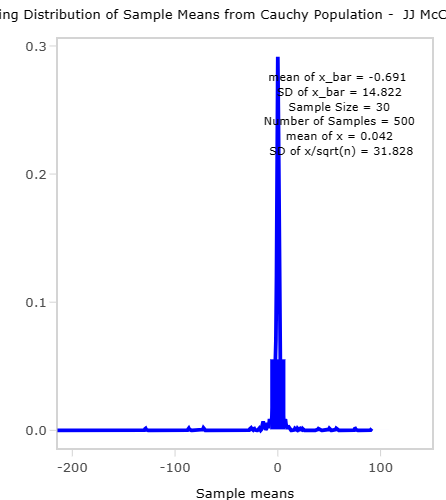 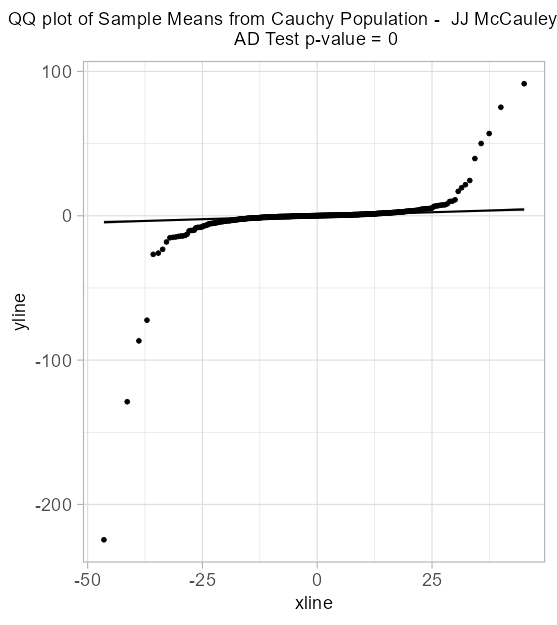  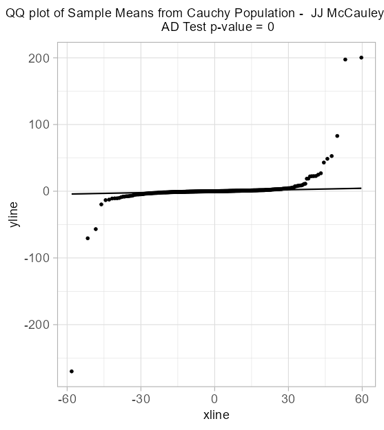

**End of Assignment 4**

So, what can we do when assumption 1 and/or 2 are not satisfied? Interestingly, we can have a "Central Limit Theorem" for **Sample Medians** (we are dealing with sample means only by far). Of course, the sample medians version CLT also require OTHER assumptions. We don't go into the details here, but for the case of Cauchy, we can say the assumptions are satisfied. In this version, the mean of the sampling distribution of the sample medians is the population median, and the standard deviation is proportional to $1/\sqrt{n}$.

## Assignment 5

1.  Go to the tab "Sampling Distribution - Sample Median"

2.  Set the Population Distribution as "Cauchy", Number of samples as 500, then change sample size as 10, 50, 100, and 300 respectively.

3.  For each selected sample size, download the histogram and QQ-plot, then insert below.

Samples: 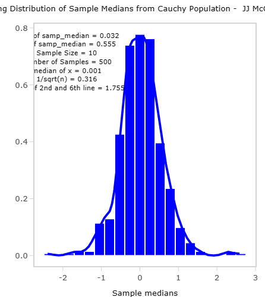 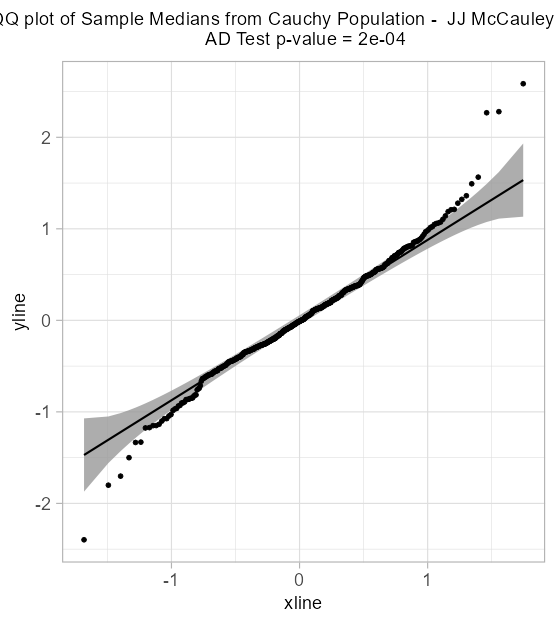

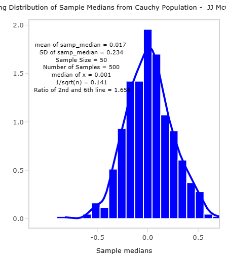 

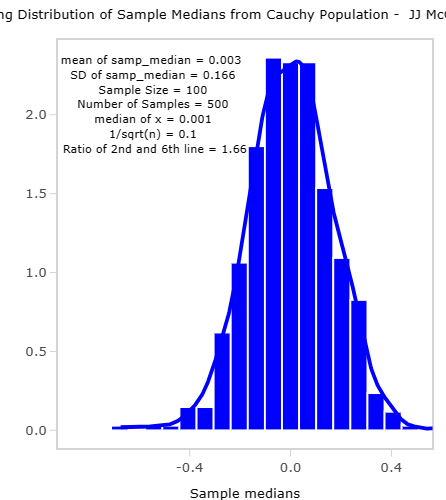 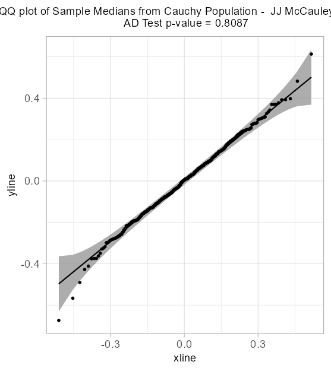

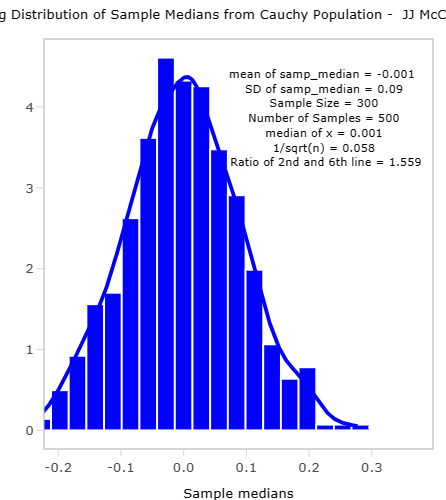 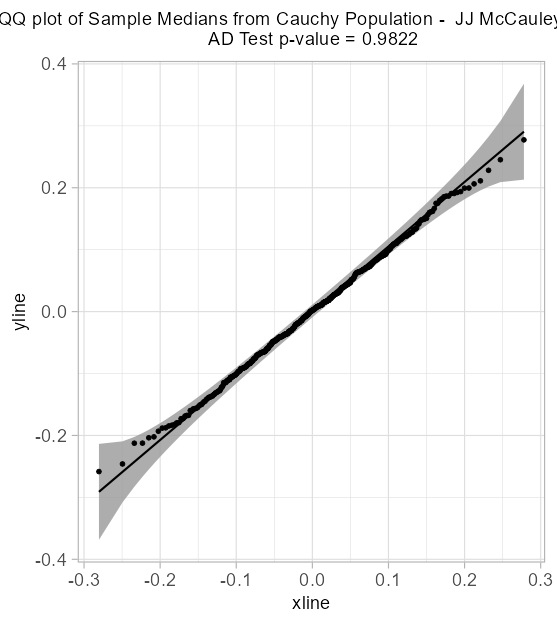

4.  For each selected sample size, compare the "mean of samp_median" and "median of x" on the histogram. Then check if the "Ratio of 2nd and 6th line" are approximately equal to each others for different sample size. What is your observations.

    ```         
    When the sample size is 10, the mean of samp_median is .032 while the median of x is .001, which is dissimular. The ratio of 2nd and 6th line is 1.755.
    When the sample size is 50, the mean of samp_median is .017 while the median of x is .001, which is somewhat similar. The ratio of 2nd and 6th line is 1.655.
    When the sample size is 100, the mean of samp_median is .003 while the median of x is .001, This is fairly similar. The ratio of 2nd and 6th line is 1.66.
    When the sample size is 300, the mean of samp_median is -.001 while the median of x is .001, which is similar. The ratio of 2nd and 6th line is 1.559.

    As the sample sizes increased, the gaps between the mean of samp_median and the median of x were reduced immensely. Additionally, the Ratio of 2nd and 6th line stayed approximately the same throughout the different samples, slowly decreasing as the sample sizes got larger.
    ```

5.  For each selected sample size, is the sampling distribution of sample median approximately normal? How does the sample size increasing affect the normality approaching?

    ```         
    The sampling distributions were all approximately normal, with each distribution becoming closer to a normal distribution as the sample size increased.
    ```

**End of Assignment 5**

# Part IV: Knit this markdown file to a html report

After you complete all the above assignments, click the Knit button to create a html report. Submit that html report.
